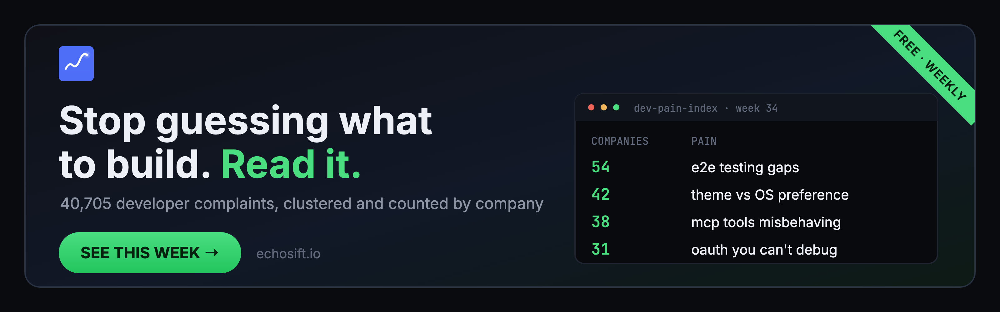

# Validated Developer Pain Signals — Week of August 17, 2026

  

10 of the widest developer pains right now, ranked by **distinct companies
affected**, not upvotes. Arrows show the last 7 days against the prior 7.
Sources: GitHub Issues, Stack Overflow, Hacker News, Bluesky.

| # | Pain | Companies | 7d | Type |
|---|------|-----------|----|------|
| 1 | E2E testing is the first thing teams cut and the first thing that bites them | 54 | ↑ 3 → 5 | feature request |
| 2 | Dark mode / theme toggles that fight the OS preference | 42 | ↓ 2 → 1 | complaint |
| 3 | Documentation links rot faster than anyone fixes them | 40 | ↓ 6 → 3 | bug |
| 4 | MCP tools that connect but don't behave (visibility, naming, schemas) | 38 | ↓ 4 → 3 | bug |
| 5 | OAuth flows that break exactly where you can't debug them | 31 | ↑ 3 → 4 | complaint |
| 6 | CI pipelines that gate nothing or flake constantly | 21 | ↑ 7 → 12 | bug |
| 7 | Color contrast failing WCAG AA in shipped themes | 20 | ↑ 1 → 2 | complaint |
| 8 | AI agents forget everything between sessions | 17 | ↓ 5 → 1 | feature request |
| 9 | Single-step admin transfer can brick your whole registry | 13 | ↑ 0 → 4 | complaint |
| 10 | npm peer dependency hell, now with hidden failure modes | 12 | ↓ 3 → 1 | bug |

## The evidence

<b>1. E2E testing (54 companies)</b>

- "e2e: repair the 44 quarantined end-to-end tests" — [upnext-frontend#248](https://github.com/binhphanbp/upnext-frontend/issues/248)
- "CI never runs the sealed acceptance suite — a red slice sat on main for a day" — [coord-portal#77](https://github.com/JDonaghy/coord-portal/issues/77)
- "[P1] Add deterministic frontend E2E and accessibility gates" — [little-mere-news#12](https://github.com/Gyliardson/little-mere-news/issues/12)

<b>2. Theme / dark mode consistency (42 companies)</b>

- "Tailwind `dark:` follows the OS, not the app's theme toggle" — [prismalens#423](https://github.com/prismalens/prismalens/issues/423)
- "Admin dark mode leaks to the public surface" — [khaopad#150](https://github.com/codustry/khaopad/issues/150)
- "A diagram's initial theme falls back to the reader's OS preference, with no way for the author to state an intent" — [archify#58](https://github.com/tt-a1i/archify/issues/58)

<b>3. Broken documentation links (40 companies)</b>

- "README links to missing docs/screenshot.png" — [beam#243](https://github.com/frecar/beam/issues/243)
- "Merged route sources link to nonexistent anchor" — [pokemon-sims#3419](https://github.com/FlareZ123/pokemon-sims/issues/3419)
- "Two stale index.md line references, already wrong at origin/main" — [insight-wave#1435](https://github.com/cogni-work/insight-wave/issues/1435)

<b>4. MCP tool reliability (38 companies)</b>

- "Every MCP tool call fails with ENTITY_VISIBILITY_ENFORCED (entity-independent tools included)" — [ha-mcp#2228](https://github.com/homeassistant-ai/ha-mcp/issues/2228)
- "The MCP server never publishes tool annotations or output schemas" — [platform#561](https://github.com/ProAgentStore/platform/issues/561)
- "MCP tools with hyphens in tool names fail via standard dispatcher" — [jcode#936](https://github.com/1jehuang/jcode/issues/936)

<b>5. OAuth breakage (31 companies)</b>

- "MCP OAuth authorization URL never surfaced in remote environments, connection times out" — [Kiro#10817](https://github.com/kirodotdev/Kiro/issues/10817)
- "Custom HTTP MCP servers cannot enter preregistered OAuth client secrets" — [zed#62553](https://github.com/zed-industries/zed/issues/62553)
- "OAuth callback responds 400 missing nonce. The nonce is present in the callback URL" — [platform#135](https://github.com/proappstore-online/platform/issues/135)

<b>6. CI pipelines gating nothing (21 companies)</b>

- "Recurrent CI flakes: CPU-efficiency below threshold on unrelated heads" — [gomap#4183](https://github.com/snissn/gomap/issues/4183)
- "Push validation misaligned with documented branch lanes: no Actions run for its head" — [workbench-kit#283](https://github.com/NewChoBo/workbench-kit/issues/283)

<b>7. WCAG color contrast (20 companies)</b>

- "Accent button text fails AA on hover in blueprint (3.22:1) and farm (3.42:1)" — [PrintFarmer#1101](https://github.com/OlyForge3D/PrintFarmer/issues/1101)
- "WCAG 1.4.3 Does Not Support: text below 4.5:1 contrast" — [a11y-e2e-test#4](https://github.com/neupanephari/a11y-e2e-test/issues/4)

<b>8. AI agent memory (17 companies)</b>

- "Feature Request: Portable Memory Transfer for MCP Agents" — [sarvam-mcp#75](https://github.com/sarvamai/sarvam-mcp/issues/75)
- "Agents that forget everything between conversations cannot act as co-workers" — [aihub-core#1710](https://github.com/bbvch-ai/aihub-core/issues/1710)

<b>9. Unsafe admin transfer (13 companies)</b>

- "Make admin transfer two-step to prevent bricking the registry" — [octraban_contract#27](https://github.com/octraban/octraban_contract/issues/27)
- "Three overlapping admin-assignment paths with different security properties" — [Hunty-contract#673](https://github.com/Samuel1-ona/Hunty-contract/issues/673)

<b>10. npm dependency resolution (12 companies)</b>

- "ERESOLVE: @angular-builders/jest@20 depends on deprecated peer" — [angular-builders#2387](https://github.com/just-jeb/angular-builders/issues/2387)
- ".npmrc sets legacy-peer-deps=true, hiding all peer dependency conflicts" — [hunty#852](https://github.com/Samuel1-ona/hunty/issues/852)
- ".npmrc shamefully-hoist=true masks at least 15 undeclared dependencies" — [tuff#579](https://github.com/talex-touch/tuff/issues/579)

## How this is generated

Complaints from GitHub / Stack Overflow / Hacker News / Bluesky are clustered
nightly with NLP into 40,705 tracked pain signals, then ranked by **distinct
companies affected** (owner count), not by upvotes. 307 signals currently span
5+ independent products, roughly 1% of everything tracked. These are 10 of the
widest.

Two things worth knowing: some linked issues are closed, which counts as
evidence the pain cost someone engineering hours, not that the market solved it.
And a few qualifying clusters are held back each week when their evidence is too
repo-specific to be useful to anyone else.

Generated with [EchoSift](https://echosift.io). Full board: 40,000+ clusters,
MCP server for your coding agent included.

---

⭐ **Star** if this saved you research time
🔔 **Watch → Custom → Releases** to get next Monday's drop

Report license: CC BY 4.0. Quotes belong to their authors, linked above.
